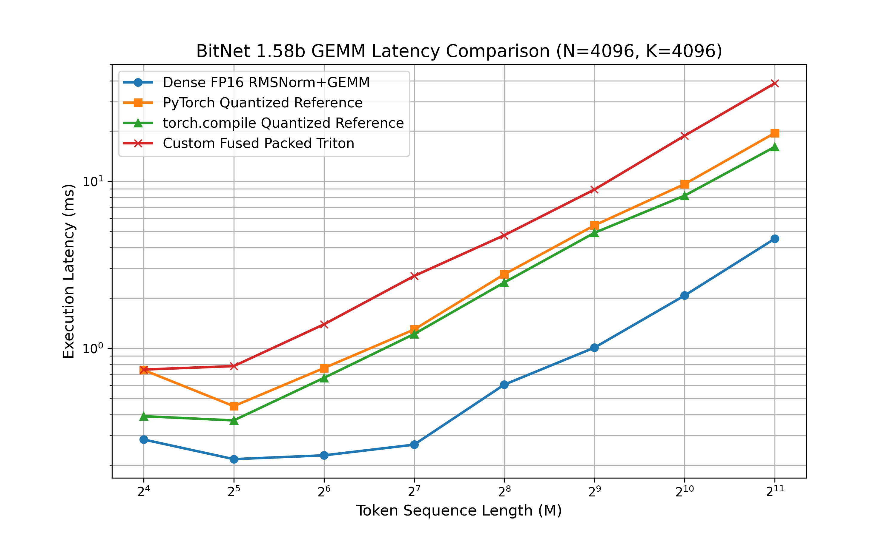

# BitNet 1.58b Fused Triton Kernel & Weight Packing

This repository is a prototype GPU kernel path for BitNet-style 1.58-bit ternary
weights. It includes CPU-side 2-bit weight packing, a Triton kernel that fuses
RMSNorm, dynamic activation quantization, packed weight unpacking, and tiled dot
product accumulation, plus a benchmark harness for correctness and latency tests.

The current kernel uses packed ternary weights and quantized activations, but the
dot-product path is still expressed through Triton `tl.dot` with `float16` input
tiles. Treat it as a fused packed-weight prototype, not yet as a finished
integer-GEMM implementation.

## The Systems Engineering Problem

BitNet b1.58-style models restrict weights to `{-1, 0, 1}`. That creates an
opportunity to reduce weight bandwidth dramatically, but a naive PyTorch
implementation still pays for several expensive memory movements:

1. Activations are read to compute RMSNorm.
2. Normalized activations are materialized or recomputed for quantization.
3. Ternary weights are often stored in byte or floating-point formats instead of
   compact 2-bit form.

This project explores how much of that work can be moved into one GPU kernel
while keeping weights packed in memory.

## Current Approach

1. **Fused activation handling**: the Triton kernel computes RMSNorm statistics,
   quantizes activations, and performs GEMM inside one kernel launch. The current
   implementation reads activations once for row statistics and again for the
   tiled dot-product pass, avoiding intermediate HBM writes.
2. **2-bit weight packing**: four ternary weights are stored in one `int8` byte.
   This is up to 8x smaller than FP16 weight storage and 16x smaller than FP32.
3. **On-the-fly unpacking**: packed bytes are loaded and unpacked with bit shifts
   immediately before dot-product accumulation.
4. **Same-math reference benchmark**: `benchmark.py` compares the custom kernel
   against a PyTorch reference that performs the same RMSNorm, quantization,
   ternary GEMM, and dequantization math.

## Weight Packing Layout

Ternary weights are mapped to 2-bit values:

```text
-1 -> 00
 0 -> 01
 1 -> 10
```

A single `int8` byte stores four packed weights:

```text
[ weight 3 | weight 2 | weight 1 | weight 0 ]
```

If `K` is not divisible by 4, packing pads the final byte with zero-weight lanes
(`01`). The kernel expects packed weights with shape `(N, ceil(K / 4))`.

## File Structure

- `bitnet_packing.py`: CPU/GPU PyTorch utility for packing ternary weights into
  2-bit byte storage and unpacking them for validation.
- `bitnet_kernel.py`: fused Triton kernel, packed-GEMM diagnostic kernel, and
  Python wrappers.
- `benchmark.py`: CPU packing validation, GPU correctness checks, and benchmark
  chart generation. It reports both the full fused kernel and a diagnostic
  packed-GEMM-only path with precomputed activation quantization.
- `tests/test_packing.py`: fast pytest coverage for packing invariants.

## Local CPU Validation

CPU validation checks the packing path only:

```bash
pip install -r requirements.txt
pytest
python benchmark.py
```

On a machine without CUDA, `benchmark.py` runs the CPU packing validation and
prints GPU benchmark instructions.

## GPU Benchmark Workflow

Use Google Colab or a Linux environment with an NVIDIA GPU:

```bash
pip install -r requirements-gpu.txt
python benchmark.py
```

The script runs:

1. CPU pack/unpack validation.
2. GPU correctness checks for standard and padded `K` shapes.
3. Latency benchmarks across sequence lengths for the PyTorch references, the
   full fused Triton kernel, and the packed-GEMM-only diagnostic path.
4. A chart saved as `benchmark_results.png`.

To sweep Triton tile and launch parameters on one representative shape:

```bash
BITNET_TUNE=1 PYTHONPATH=. python benchmark.py
```

By default, this tunes at `M=512, N=4096, K=4096`. You can change the sequence
length with:

```bash
BITNET_TUNE=1 BITNET_TUNE_M=1024 PYTHONPATH=. python benchmark.py
```

The tuning sweep reports drift against the PyTorch reference and against the
default kernel output, then ranks finite-output configs by latency. The large
tuning shape may have larger FP16 accumulation drift than the smaller correctness
suite, so use the printed drift metrics when deciding whether to promote a
configuration.

## Current Benchmark Status

Google Colab Tesla T4 validation passes for both the main benchmark shape and a
non-multiple-of-4 hidden dimension:

```text
M=128, N=1024, K=2048: max diff 8.6578e-02, rtol=1e-2, atol=1e-1
M=17,  N=129,  K=513:  max diff 2.4048e-02, rtol=1e-2, atol=1e-1
```

The current kernel is correctness-valid, but not yet performance-competitive.
After a tuning sweep, the default Triton launch config is
`BLOCK_M=32, BLOCK_N=128, BLOCK_K=64, num_warps=4, num_stages=3`. This improves
the full benchmark substantially over the original `64x64x64` default, but it
is still slower than the PyTorch quantized reference for most sequence lengths.

Tesla T4 results with `N=4096, K=4096`:

| M | Dense FP16 (ms) | Quant Ref (ms) | Fused Triton (ms) | Speedup vs Quant Ref |
|---:|---:|---:|---:|---:|
| 16 | 0.284 | 0.741 | 0.746 | 0.99x |
| 32 | 0.217 | 0.450 | 0.782 | 0.58x |
| 64 | 0.229 | 0.761 | 1.391 | 0.55x |
| 128 | 0.265 | 1.296 | 2.709 | 0.48x |
| 256 | 0.606 | 2.775 | 4.752 | 0.58x |
| 512 | 1.009 | 5.447 | 8.927 | 0.61x |
| 1024 | 2.071 | 9.626 | 18.754 | 0.51x |
| 2048 | 4.531 | 19.466 | 38.639 | 0.50x |



## Next Engineering Targets

- Use the packed-GEMM-only diagnostic results to determine whether the main
  bottleneck is activation RMSNorm/quantization or packed-weight GEMM/unpacking.
- Re-run the Tesla T4 benchmark and refresh the table/chart with the new packed
  GEMM diagnostic line.
- Optimize the packed-weight unpack layout without redundantly reloading packed
  bytes across logical weight lanes.
- Reduce activation bandwidth by avoiding the current two-pass activation read
  for RMS/max statistics and GEMM input loading.
- Replace the current `float16` `tl.dot` path with a true integer or ternary
  accumulation implementation if the goal is to claim integer GEMM.
- Add CI for CPU packing tests.
- Add kernel-level tests for more shapes, dtypes, and edge cases once a CUDA
  test environment is available.
